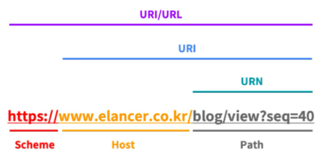

# REST API란? (중요도 5)

## Table of Conetents

1. [REST API란](#REST-API란?)
2. [REST란 무엇인가](#REST란-무엇인가?)
3. [API란 무엇인가](#API란-무엇인가?)
4. [용어 공부](#용어-공부)

# REST API란?

REpresentational State Transfer API
REST 원칙을 적용하여 서비스 API를 설계한 것을 말한다.
대부분의 서비스가 REST API를 제공한다.

## REST란 무엇인가?

- 자원을 이름으로 구분하여 해당 자원의 상태를 주고 받는 모든 것.
- HTTP URI를 통해 자원을 명시하고, HTTP 메서드(POST, GET, PUT, DELETE)를 통해 해당 자원에 대한 CRUD를 적용하는 것을 말한다.
- 즉, 자원 기반의 구조 설계의 중심에 자원이 있고, HTTP 메서드를 통해 이를 처리한다.

### REST 구성 요소

1. 자원(Resource): HTTP URI
2. 자원에 대한 행위(Verb): HTTP Method
3. 자원에 대한 행위의 내용(Representations): HTTP Message Pay Load

### REST의 특징

1. Server-Client(서버-클라이언트 구조)
2. Stateless(무상태)
3. Cacheable(캐시 처리 기능)
4. Layered System(계층화)
5. Uniform Interface(인터페이스 일관성)

### REST의 장단점

장점

- HTTP 프로토콜의 인프라를 그대로 사용하므로 REST API 사용을 위한 별도의 인프라를 구축할 필요가 없다.
- HTTP 프로토콜의 표준을 최대한 활용하여 여러 추가적인 장점을 함께 가져갈 수 있게 해준다.
- HTTP 표준 프로토콜에 따르는 모든 플랫폼에서 사용이 가능하다.
- Hypermedia API의 기본을 충실히 지키면서 범용성을 보장한다.
- REST API 메시지가 의도하는 바를 명확히 나타내므로 의도하는 바를 쉽게 파악할 수 있다.
- 여러 가지 서비스 디자인에서 생길 수 있는 문제를 최소화한다.
- 서버와 클라이언트의 역할을 명확하게 분리한다.

단점

- 표준 규약이 존재하지 않아 정의가 필요하다.
- HTTP Method 형태가 제한적이다.
- 브라우저를 통해 테스트할 일이 많은 서비스라면 쉽게 고칠 수 있는 URL보다 Header 정보의 값을 처리해야 하므로 전문성이 요구된다.
- 구형 브라우저에서 호환이 되지 않아 지원해주지 못하는 동작들이 많다.(ex. 익스플로러)

## API란 무엇인가?

- Application Programming Interface.
- 응용 프로그램에서 사용할 수 있도록 운영 체제나 프로그래밍 언어가 제공하는 기능을 제어할 수 있게 만든 인터페이스.
- 구글 맵 API, 카카오 비전 API 등 기존에 있는 응용 프로그램을 통해서 데이터를 제공받거나 기능을 사용하고자 할 때 사용하는 인터페이스 및 규격을 말한다.
- 쉽게 말해 프로그램끼리 통신할 수 있도록 하는 중재자다.
- 프로그래밍 언어, 운영체제 등에서도 사용되는 범용적인 용어.

## REST API 설계 예시

### 1. URI는 동사보다는 명사를, 대문자보다는 소문자를 사용해야 한다.

- Bad Ex. http://kmj00.com/Running/
- Good Ex. http://kmj00.com/run/

### 2. 마지막에 슬래시(/)를 포함하지 않는다.

- Bad Ex. http://kmj00.com/test/
- Good Ex. http://kmj00.com/test

### 3. 언더바 대신 하이픈을 사용한다.

- Bad Ex. http://kmj00.com/test_blog
- Good Ex. http://kmj00.com/test-blog

### 4. 파일확장자는 URI에 포함하지 않는다.

- Bad Ex. http://kmj00.com/photo.jpg
- Good Ex. http://kmj00.com/photo

### 5. 행위를 포함하지 않는다.

- Bad Ex. http://kmj00.com/delete-post/1
- Good Ex. http://kmj00.com/post/1

## RESTful이란?

- REST의 원리를 따르는 시스템을 의미한다.
- 하지만 REST를 사용했다 하여 모두가 RESTful한 것은 아니다.
- REST API의 설계 규칙을 올바르게 지킨 시스템을 RESTful하다고 말할 수 있다.
- 모든 CRUD 기능을 POST로 처리하는 API, URI 규칙을 올바르게 지키지 않은 API 등은 REST API를 사용하였으나 RESTful하지 못한 시스템이라고 할 수 있따.

## 용어 공부

- 자원(Resource) : 문서, 그림, DB, 이미지, 동영상, 해당 소프트웨어 자체 등의 웹에서 사용되는 모든 자료를 의미한다.
- URI(Uniform Resource Identifier) : 통합 자원 식별자. 인터넷상의 리소스 '자원 자체'를 식별하는 고유한 문자열 시퀀스. 리소스(전화, 지도, 이미지, 텍스트)에 접근할 수 있는 유일한(Uniform) 식별자(Identifier)를 의미한다. URI를 수신하는 기기는 해당 URI에 맞게 데이터를 반환한다.
- URI와 URL의 차이점
  - URI=식별자 -> naver.com (리소스 이름만 나타냄)
  - URL=식별자+위치 -> https://naver.com (리소스 이름, 어떻게 도달할 수 있는지 위치까지 나타냄)
  - URL은 일종의 URI다. URL은 URI지만, 모든 URI가 URL인 것은 아니다.
  - URL은 프로토콜과 결합한 상태다.
    
    Scheme: 리소스에 접근하는 데 사용할 프로토콜, 웹에서는 http 또는 https를 사용
    Host: 접근할 대상(서버)의 호스트명
    Path: 접근할 대상(서버)의 경로에 대한 상세 정보
- CRUD : 대부분의 컴퓨터가 가지는 기본적인 데이터 처리 기능인 Create(생성), Read(읽기), Update(갱신), Delete(삭제)를 묶어서 일컫는 말. 사용자 인터페이스가 갖추어야 할 기능(정보의 참조/검색/갱신)을 가리키는 용어로서도 사용된다.

참고자료
https://github.com/Esoolgnah/Frontend-Interview-Questions/blob/main/Notes/important-5/rest-api.md
https://www.elancer.co.kr/blog/view?seq=74
https://khj93.tistory.com/entry/%EB%84%A4%ED%8A%B8%EC%9B%8C%ED%81%AC-REST-API%EB%9E%80-REST-RESTful%EC%9D%B4%EB%9E%80
